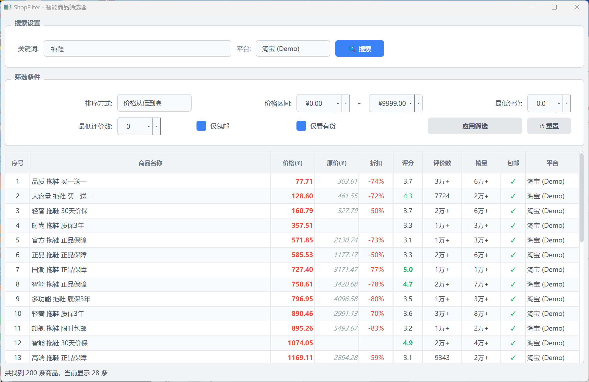

# ShopFilter — AI 驱动的智能选品助手

  
  
  
  
  

> **本项目全程由 OpenCode AI 智能体辅助开发完成，从架构设计到代码实现，人机协作打造。**

---

ShopFilter 是一个智能化的电商商品聚合与筛选桌面应用，模拟"购物智能体"的思路：

  <b>输入意图 → 多源搜索 → 智能过滤 → 综合排序 → 输出最优决策</b>

基于 **Qt6 + C++17** 构建，你只需告诉它要什么，剩下的搜索、比对、排序、筛选全自动完成。

## 界面预览

  

---

## 功能

| 模块 | 能力 |
|------|------|
| 意图理解 | 关键词输入，智能体自动多平台并发抓取 |
| 多维感知 | 解析价格、评分、销量、折扣、包邮、库存等信息 |
| 智能决策 | 内置加权综合评分模型，自动计算商品性价比 |
| 策略筛选 | 可配置筛选规则（价格区间、最低评分、免邮等） |
| 结果呈现 | 清洗去噪，按最优策略排序输出 |

---

---

## 算法构想：多维加权综合评价 (MWCE)

> 原创搜索排序算法，融合价格、口碑、销量、折扣四个维度，模拟消费者真实决策逻辑。

### 核心公式
复制
综合评分 = 价格因子 × 0.35 + 口碑因子 × 0.30 + 热度因子 × 0.20 + 折扣因子 × 0.15
| 因子 | 计算方式 | 权重 | 设计意图 |
|------|----------|------|----------|
| 价格因子 | `1 / (1 + price / 100)` | 35% | 价格越低分越高，非线性衰减避免极端值主导 |
| 口碑因子 | `rating / 5.0` | 30% | 标准化到 [0, 1]，高分商品优先 |
| 热度因子 | `min(reviews / 10000, 1)` | 20% | 评论文本量越大越可信，上限防止刷单 |
| 折扣因子 | `min(discount% / 50, 1)` | 15% | 让利空间越大越值得买，避免无效内卷 |

### 算法优势

- **抗极端偏差** — 各因子独立归一化 + 上限截断，单个维度爆表不会扭曲整体排序
- **可解释性强** — 每个因子直观对应消费决策要素，不是黑箱
- **权重可调** — 四维权重按场景灵活调整（追求性价比可提价格权重，追求品质可提口碑权重）
- **并发高效** — 多平台多线程异步抓取，O(n) 过滤 + O(n log n) 排序，大数据量依然流畅
- **多源融合** — 跨平台数据统一清洗后同台竞技，打破信息茧房

## 构建

**前置依赖**

| 依赖 | 版本要求 |
|------|----------|
| Qt | >= 6.0 (Widgets 模块) |
| CMake | >= 3.16 |
| 编译器 | 支持 C++17 (MSVC / GCC / Clang) |

---

## 技术栈

| 类别 | 技术 |
|------|------|
| 语言 | C++17 |
| 框架 | Qt6 (Widgets + 自定义 QSS 主题) |
| 构建 | CMake |
| 架构 | 插件式多平台抓取 (IScraper 接口) + 多线程并发 |
| 数据 | nlohmann/json 解析 |
| 开发 | OpenCode AI 智能体辅助 |

---

  Made with OpenCode AI Agent

## 许可

MIT License
